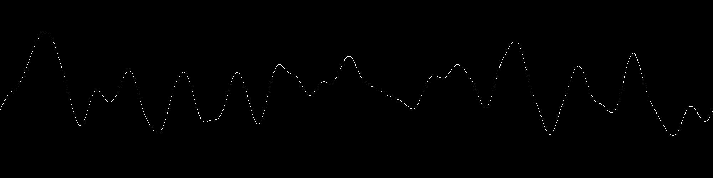

# Noise

A collection of noise algorithms

## Random Noise


```
> mill graphics.runMain --mainClass org.bbstilson.graphics.noise.RandomNoise
```

## Perlin Noise


|Width|Height|Num Cells X|Num Cells Y|
|:---|:---|:---|:---|
|300|300|8|8|


|Width|Height|Num Cells X|Num Cells Y|
|:---|:---|:---|:---|
|300|300|10|1|

## 3-dimentional Perlin Noise (youtube video)

<a href="http://www.youtube.com/watch?feature=player_embedded&v=In6MKsEksfQ
" target="_blank"></a>

`$DEPTH` images are rendered in parallel and then compiled into a video using QuickTime.

### Sources

https://flafla2.github.io/2014/08/09/perlinnoise.html

https://weber.itn.liu.se/~stegu/simplexnoise/simplexnoise.pdf

https://en.wikipedia.org/wiki/Perlin_noise#Algorithm_detail

https://www.youtube.com/watch?v=MJ3bvCkHJtE

## Linear Perlin



This was a simple extension of the 2d Perlin Noise generator. First, we generate a 2D Perlin Noise field. Then, rather than calculating what the color is at every pixel in the image, we only calculate pixels that fall on a circle. Next, we convert the color value (0-255) to a y-offset position where 127 is `height / 2` and 255 is 100% of some "window" (so that pixels aren't drawn to the edge of the image). Finally, progress around the circle is converted to progress through the image rectangle, which gives us our X value.
