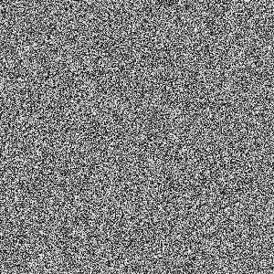
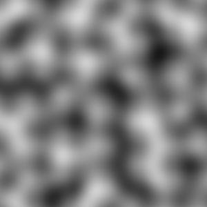
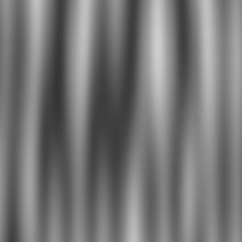

# Noise

A collection of noise algorithms

## Random Noise



```
> mill graphics.runMain --mainClass org.bbstilson.graphics.noise.RandomNoise
```

## Perlin Noise



|Width|Height|Num Cells X|Num Cells Y|
|:---|:---|:---|:---|
|300|300|8|8|



|Width|Height|Num Cells X|Num Cells Y|
|:---|:---|:---|:---|
|300|300|10|1|

## 3-dimentional Perlin Noise (youtube video)

<a href="http://www.youtube.com/watch?feature=player_embedded&v=In6MKsEksfQ
" target="_blank"></a>

`$DEPTH` images are rendered in parallel and then compiled into a video using QuickTime.

### Sources

https://flafla2.github.io/2014/08/09/perlinnoise.html

https://weber.itn.liu.se/~stegu/simplexnoise/simplexnoise.pdf

https://en.wikipedia.org/wiki/Perlin_noise#Algorithm_detail

https://www.youtube.com/watch?v=MJ3bvCkHJtE

